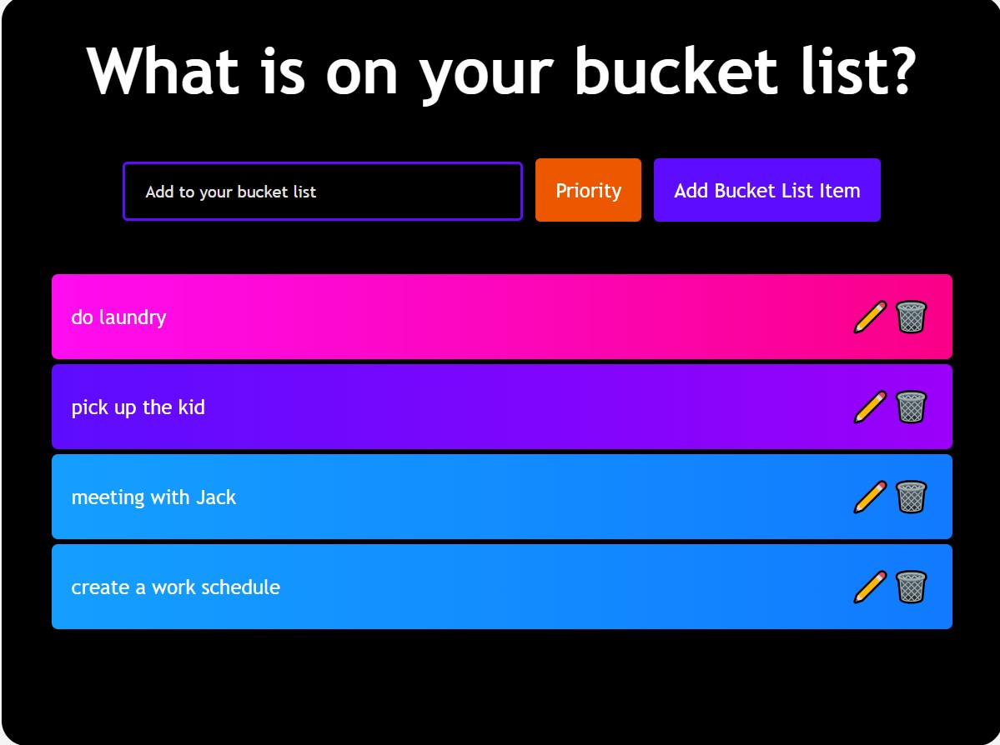
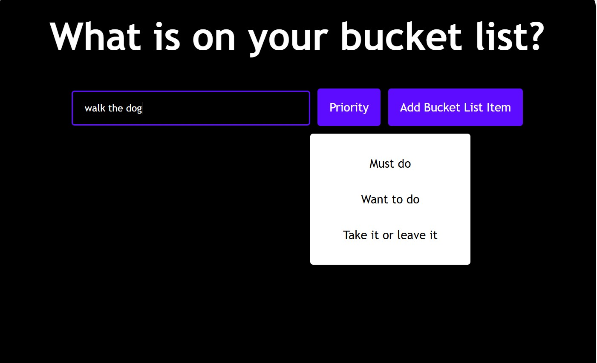
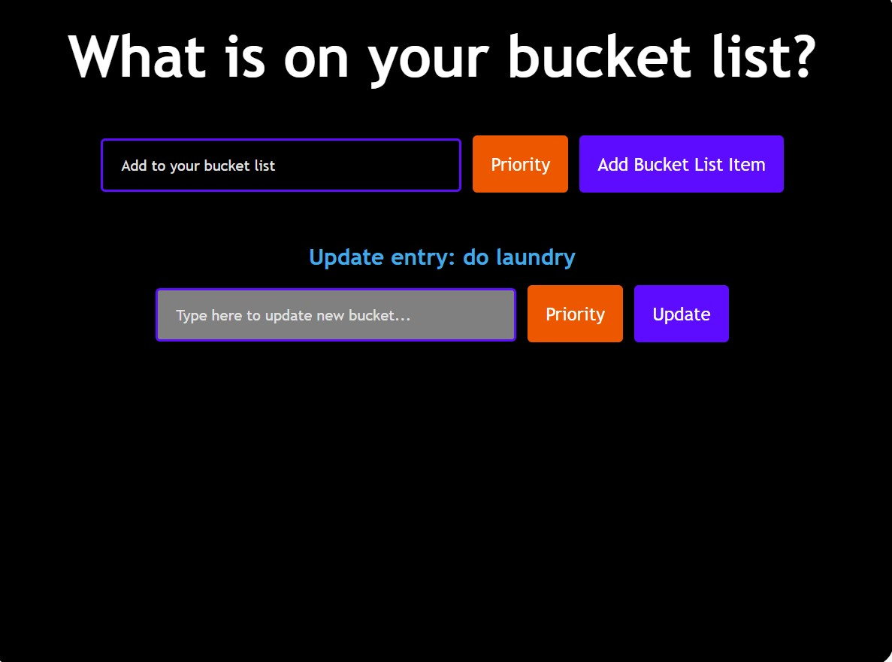

# React Job List Application
react front end, js
[https://react-kpportfolio.onrender.com/](https://kp-portfolio-2025.onrender.com/)


This application is built with React and demonstrates the use of the `useState` Hook to manage dynamic state. Users can create a personalized list of jobs or tasks, assign a priority level to each task—such as "must do", "want to do", or "take it or leave it"—and easily manage their list.

## Features

- **Add Jobs:** Enter a new job or task and assign it a priority level.
- **Prioritize Tasks:** Choose between "must do", "want to do", or "take it or leave it" for each job.
- **Edit Tasks:** Update the job description or change its priority at any time.
- **Delete Tasks:** Remove jobs from the list as needed.
- **Visual Priority:** Each job displays a color or style that reflects its priority, making it easy to identify important tasks.

This project highlights key React concepts, including state management with `useState`, passing data as props, and rendering lists dynamically. It provides a practical example of building an interactive and user-friendly task management tool with React.

## Screenshots

### Main Interface


### Adding a New Job


### Editing a Job



## Installation:


To make changes to the code base, clone the repo ([repo](https://github.com/khoiphan-9194/React-BucketList/)).
 Run the following at the command line
```
    - npm install
    - npm run dev
    or refer to script in package.json
    
```

Users can also feel free to access the live application directly by visiting the render link ([Khoi Phan Portfolio](https://kp-portfolio-2025.onrender.com/)).

## Submission:
 [KhoiPhan-Github repository](https://github.com/khoiphan-9194/React-BucketList)

## License
[](https://opensource.org/licenses/MIT)

SVG Logo Maker © is licensed under the ISC license.  

For more information regarding the SVG Logo Maker's license, please visit: 
https://opensource.org/licenses/MIT

  
## Questions?
  
### Github:[khoiphan-9194](https://github.com/khoiphan-9194)
  
### Reach Me Via Email: phanminhkhoi91@gmail.com

Thanks for viewing!

